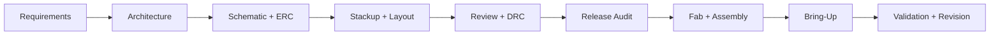

<div align="center">

# PCB Designer

**An open Agent Skill that turns AI coding agents into disciplined PCB design,
review, and fabrication-release partners.**


[](https://github.com/SPREsxm/claude-pcb-designer/actions/workflows/validate.yml)
[](https://github.com/SPREsxm/claude-pcb-designer/releases)
[](LICENSE)
[](https://github.com/SPREsxm/claude-pcb-designer/stargazers)

[English](README.md) | [简体中文](README.zh-CN.md)

</div>

PCB Designer covers the full hardware path: requirements, component selection,
schematic review, stackup, placement, routing, power, signal integrity,
thermal design, DFM/DFA, fabrication release, compliance planning, and board
bring-up.

It works with Codex, Claude Code, and other tools that understand the
[Agent Skills](https://agentskills.io/) format.

## Why This Skill Is Different

Most "PCB prompt packs" stop at generic advice. This project adds the parts
that make hardware work repeatable:

- **Evidence-first reasoning** - datasheets, supplier stackups, and actual
  project files outrank generic rules.
- **Deterministic calculators** - trace width, via current, impedance, LDO
  thermal margin, battery life, buck inductors, RC filters, dividers, and
  power budgets are computed by scripts, not guessed.
- **Release auditing** - a dependency-free tool checks Gerber/drill presence,
  BOM/CPL columns, designator consistency, and common packaging mistakes.
- **Progressive disclosure** - a concise `SKILL.md` routes to focused
  references only when needed.
- **Safety boundaries** - mains, lithium batteries, medical, automotive,
  aerospace, and other critical domains explicitly require qualified human
  review.
- **CI-tested** - the calculators, release auditor, references, and skill
  metadata are validated on every push.

## What Changed in v3

- Added 11 deterministic calculator commands with JSON output.
- Added a release auditor for Gerber, drill, BOM, and CPL packages.
- Added a package validator and cross-platform CI.
- Split the monolithic guidance into focused, progressively loaded references.
- Added design, review, release, RFQ, power-budget, and bring-up templates.
- Added 12 realistic behavioral evals and Chinese documentation.
- Added explicit safety and verification boundaries.

## Install

### Codex

```bash
git clone https://github.com/SPREsxm/claude-pcb-designer.git
cd claude-pcb-designer
python scripts/install.py --target codex --force
```

### Claude Code

```bash
python scripts/install.py --target claude --force
```

### Generic Agent Skills directory

```bash
python scripts/install.py --target agents --force
```

The installer copies only the runtime skill package: `SKILL.md`,
`references/`, `scripts/`, `templates/`, `rules/`, and the examples.

If the target is already a Git checkout, update it with `git pull --ff-only`
instead of replacing the directory.

## Try It

```text
Design an ESP32-S3 sensor board with SPI IMU, I2C barometer, microSD,
USB-C charging, and a 1S LiPo. The enclosure is plastic, the board is
50 x 35 mm, and the prototype quantity is 10.
```

```text
Review this KiCad layout for fabrication blockers, return-path problems,
thermal risks, and missing test access. Lead with the findings and cite
the exact file or net for each one.
```

```text
My 5 V to 3.3 V LDO runs at 800 mA in a sealed enclosure at 60 C.
Check dropout and thermal margin, then recommend a better topology.
```

```text
Audit my release folder before I send it to JLCPCB assembly.
```

## What Is Included

| Area | Coverage |
|---|---|
| Design intake | Requirements, environment, mechanical constraints, compliance, test strategy |
| Schematic | Power, grounding, interfaces, analog, RF, high-speed, testability, ERC |
| Stackup | 2/4/6-layer planning, reference planes, impedance, controlled impedance |
| Layout review | Critical/major/minor findings with evidence and concrete fixes |
| Power | LDO/DC-DC, battery, charging, protection, sequencing, current paths |
| Signal integrity | USB, SPI, I2C, CAN, RS-485, Ethernet, LVDS/MIPI, SDIO, clocks |
| RF | Antenna keep-out, matching, reference planes, shielding, coexistence |
| Thermal | Junction temperature, copper area, thermal vias, enclosure effects |
| Manufacturing | DRC, DFM, panelization, stencil, reflow, inspection, BOM, CPL |
| Release | Gerber/drill audit, release manifest, revision control, supplier notes |
| Bring-up | First power, rails, clocks, programming, interfaces, thermal soak |
| High reliability | Derating, fault analysis, environmental stress, evidence package |
| Tools | EasyEDA/嘉立创EDA and KiCad workflows, plus optional EasyEDA API pairing |

## Bundled Tools

### PCB Calculator

```bash
python scripts/pcbcalc.py --help

python scripts/pcbcalc.py trace-width \
  --current-a 1.0 --temp-rise-c 10 --copper-oz 1

python scripts/pcbcalc.py microstrip \
  --height-mm 0.20 --er 4.3 --target-ohm 50

python scripts/pcbcalc.py diff-microstrip \
  --height-mm 0.20 --er 4.3 --spacing-mm 0.18 --target-ohm 90

python scripts/pcbcalc.py ldo \
  --vin 5 --vout 3.3 --current-a 0.8 \
  --theta-ja-c-per-w 40 --ambient-c 60

python scripts/pcbcalc.py power-budget --csv templates/power-budget.csv
```

Every command supports `--json` for agent-to-agent workflows.

### Release Auditor

```bash
python scripts/audit_release.py path/to/release --layers 4 --json
```

The auditor checks:

- top/bottom copper, mask, outline, and drill presence;
- expected inner copper for 4+ layer boards;
- empty or structurally suspicious Gerber/drill files;
- BOM columns, quantities, duplicate designators, and DNP flags;
- CPL columns and duplicate placements;
- BOM/CPL designator consistency;
- optional PCB-only versus assembly-release mode.

It cannot prove electrical correctness or certify a fabrication process.

### Skill Validator

```bash
python scripts/validate_skill.py .
python -m unittest discover -s tests -v
```

The validator checks frontmatter, local references, JSON, eval structure, and
unfinished placeholders. CI runs it on Windows, Linux, and macOS.

### Portable Package

```bash
python scripts/package_skill.py
```

This creates a deterministic runtime package under `dist/` with the skill,
references, tools, templates, rules, examples, and documentation. GitHub
release tags attach the ZIP automatically.

## Workflow



The skill enforces five gates:

1. requirements and safety boundary;
2. architecture, power tree, and schematic review;
3. stackup, placement, routing, and DRC;
4. fabrication and assembly release;
5. bring-up, measurement, and revision control.

## Repository Map

```text
pcb-designer/
|-- SKILL.md                    # Agent entrypoint and mode router
|-- references/                 # Focused design and review knowledge
|-- scripts/                    # Calculators, auditor, validator, installer
|-- templates/                  # Briefs, review reports, release and bring-up logs
|-- rules/                      # Machine-readable profiles and severity model
|-- examples/                   # Worked design and review examples
|-- evals/                      # Behavioral evaluation prompts
|-- tests/                      # Unit and integration tests
`-- .github/                    # CI and contribution templates
```

## Pair With EasyEDA API

Use this skill as the **design brain** and the EasyEDA API skill as the
**automation hands**:

| Skill | Responsibility |
|---|---|
| `pcb-designer` | Requirements, calculations, design decisions, review, release |
| `easyeda-api` | Live EasyEDA Pro project, schematic, PCB, library, and bridge operations |

The correct English name is **EasyEDA**; the Chinese name is **嘉立创EDA**.

## Quality and Limits

This project is engineering assistance, not a substitute for:

- a qualified engineer's review;
- component datasheets and errata;
- the fabricator's current capability and stackup data;
- accredited EMC, safety, or radio compliance testing;
- physical measurement, thermal testing, and manufacturing inspection.

Supplier rules and prices change. Values in `rules/fab-profiles.json` carry a
verification status and must be checked at order time.

## Contributing

Contributions are welcome, especially:

- validated supplier profiles and stackups;
- new interface or sensor patterns with datasheet references;
- additional calculator tests and edge cases;
- review examples from real re-spins;
- Chinese/English documentation improvements.

Read [CONTRIBUTING.md](CONTRIBUTING.md) before opening a pull request.

## License

MIT. See [LICENSE](LICENSE).

<div align="center">

If this saves a re-spin, star the repository so the next hardware agent can
find it.

[](https://star-history.com/#SPREsxm/claude-pcb-designer&Date)

</div>
