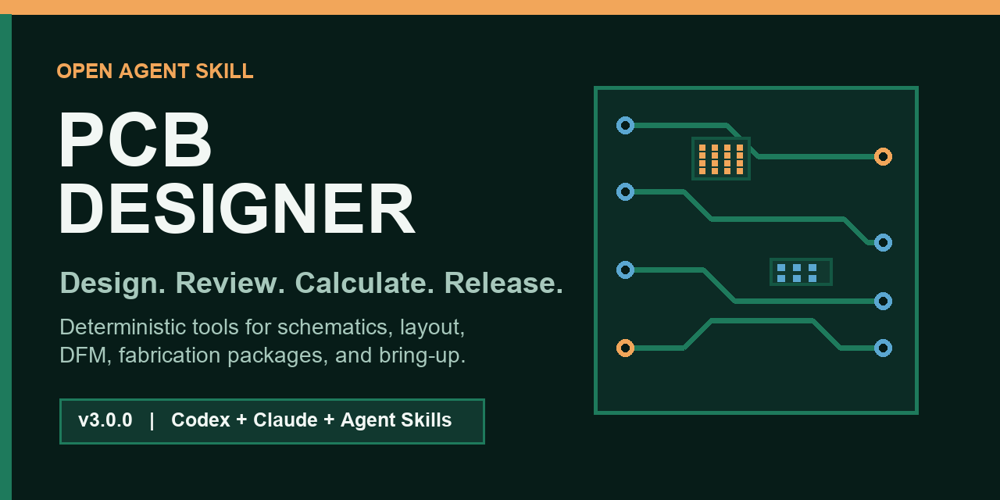

<div align="center">

# PCB Designer

**一个面向 AI Agent 的开源 PCB 设计、评审和发板工具包。**



[](https://github.com/SPREsxm/claude-pcb-designer/actions/workflows/validate.yml)
[](https://github.com/SPREsxm/claude-pcb-designer/releases)
[](LICENSE)
[](https://github.com/SPREsxm/claude-pcb-designer/stargazers)

[English](README.md) | [简体中文](README.zh-CN.md)

</div>

它不是一堆泛泛而谈的提示词。这个仓库把 PCB 设计流程拆成可执行的工程能力：
需求澄清、选型、原理图评审、叠层、布局布线、电源、信号完整性、热设计、
DFM/DFA、Gerber/BOM/CPL 发板审计、合规规划和上电调试。

支持 Codex、Claude Code，以及兼容
[Agent Skills](https://agentskills.io/) 的其他工具。

## 为什么值得用

- **证据优先**：芯片手册、供应商叠层和用户项目文件高于通用经验。
- **可复算工具**：线宽、过孔载流、阻抗、LDO 热余量、电池续航、Buck 电感、
  RC 滤波、分压和功耗预算都由脚本计算。
- **发板包审计**：无需第三方依赖即可检查 Gerber、钻孔、BOM、CPL、
  位号一致性和常见缺文件问题。
- **渐进式加载**：主 `SKILL.md` 只保留关键规则，按任务加载对应参考资料。
- **明确安全边界**：市电、锂电池、医疗、汽车、航空等场景强制要求合格人工评审。
- **CI 持续验证**：计算器、发板审计器、引用文件和 skill 元数据每次提交都会检查。

## v3 主要变化

- 新增 11 个确定性计算命令，全部支持 JSON 输出。
- 新增 Gerber、钻孔、BOM、CPL 发板包审计器。
- 新增 skill 包校验器和跨平台 CI。
- 将冗长说明拆成按需加载的专题参考。
- 新增设计说明、评审、发板、RFQ、功耗和上电模板。
- 新增 12 个真实场景评测和中文文档。
- 加入明确的安全、验证和数据手册边界。

## 安装

### Codex

```bash
git clone https://github.com/SPREsxm/claude-pcb-designer.git
cd claude-pcb-designer
python scripts/install.py --target codex --force
```

### Claude Code

```bash
python scripts/install.py --target claude --force
```

### 通用 Agent Skills 目录

```bash
python scripts/install.py --target agents --force
```

如果目标目录已经是 Git 仓库，请使用 `git pull --ff-only` 更新，不要删除
仓库元数据。

## 可以直接这样问

```text
帮我设计一个 ESP32-S3 传感器板：SPI IMU、I2C 气压计、microSD、
USB-C 充电和 1S 锂电池。塑料外壳，板子 50 x 35 mm，先做 10 片。
```

```text
评审这个 KiCad 布局，优先找发板阻塞、回流路径、热风险和测试点缺失。
按严重程度排序，每条给文件和网络证据。
```

```text
5V 转 3.3V 的 LDO 在密封外壳里 60°C 环境、800mA 负载下是否安全？
帮我算结温、压差，并判断是否需要换 Buck。
```

```text
提交嘉立创 SMT 之前，审计我的 Gerber、BOM 和坐标文件。
```

## 工具

```bash
python scripts/pcbcalc.py --help
python scripts/audit_release.py path/to/release --layers 4 --json
python scripts/validate_skill.py .
python -m unittest discover -s tests -v
python scripts/package_skill.py
```

计算器包含：

- 走线载流和压降；
- 过孔载流和电阻；
- 微带线、带状线、差分微带阻抗估算；
- LDO 结温和压差检查；
- 电池续航；
- Buck 电感、峰值电流和饱和电流需求；
- RC 滤波；
- 电阻分压；
- CSV 功耗预算汇总。

所有结果都支持 `--json`，方便 agent 之间传递结构化数据。

## 设计流程


Skill 会强制经过五道门：

1. 需求和安全边界；
2. 架构、电源树和原理图评审；
3. 叠层、布局、布线和 DRC；
4. 制板和贴片发布；
5. 上电、测量和版本管理。

## 与 EasyEDA 配合

| Skill | 职责 |
|---|---|
| `pcb-designer` | 设计判断、计算、评审、发板纪律 |
| `easyeda-api` | 通过桥接服务操作 EasyEDA Pro 项目和文档 |

英文产品名是 **EasyEDA**，中文名是 **嘉立创EDA**。

## 边界

本仓库是工程辅助工具，不能替代：

- 合格工程师的评审；
- 芯片数据手册和勘误表；
- 板厂当前工艺能力和叠层数据；
- 第三方 EMC、安全和无线认证；
- 实际测量、热测试和制造检验。

供应商规则和价格会变化。`rules/fab-profiles.json` 中的数值带有验证状态，
下单前必须重新确认。

## 参与贡献

欢迎提交：

- 已验证的板厂工艺和叠层；
- 有数据手册依据的接口或传感器设计模式；
- 计算器边界条件与测试；
- 来自真实改版的评审案例；
- 中英文文档改进。

提交前请阅读 [CONTRIBUTING.md](CONTRIBUTING.md)。

## License

MIT，详见 [LICENSE](LICENSE)。

<div align="center">

如果这个项目帮你避免了一次改版，欢迎点 Star，让更多硬件 Agent 找到它。

</div>
